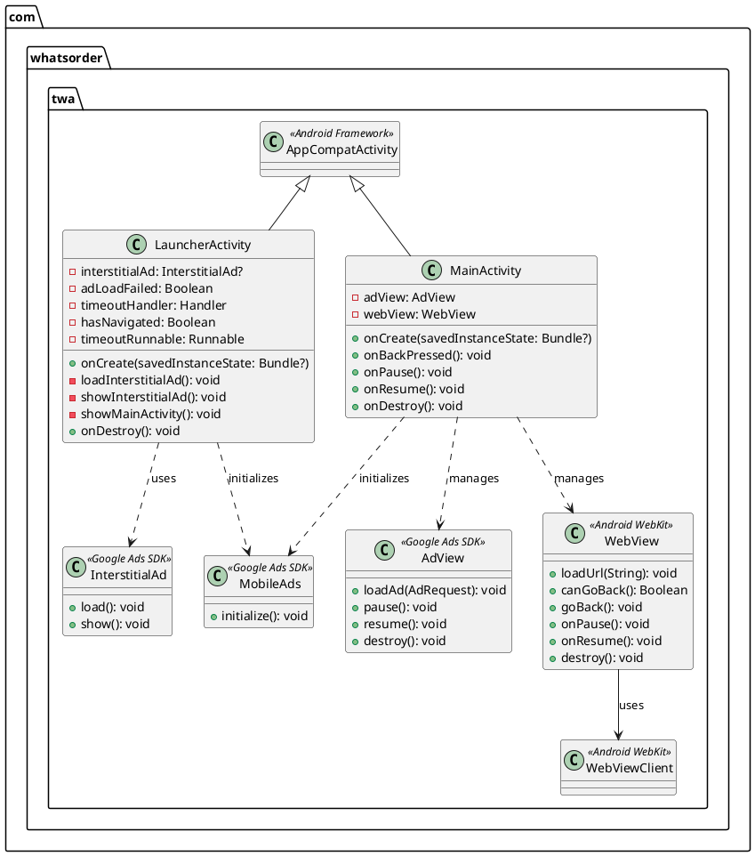
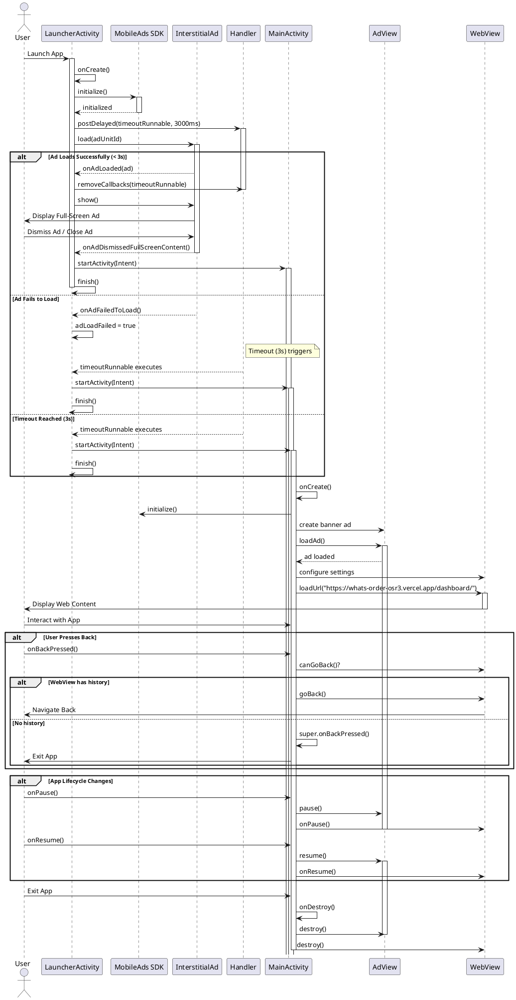
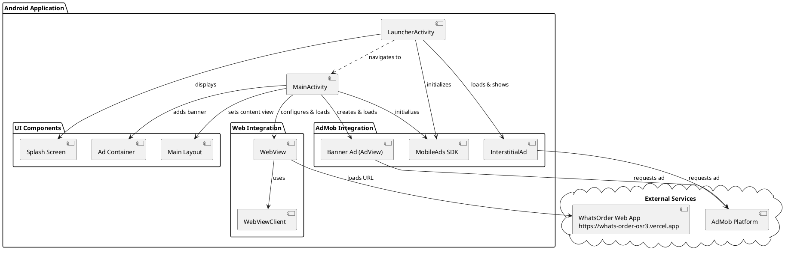
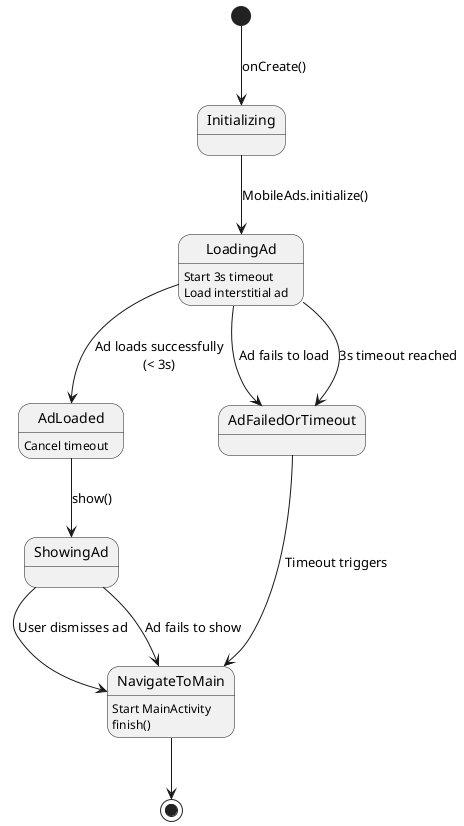
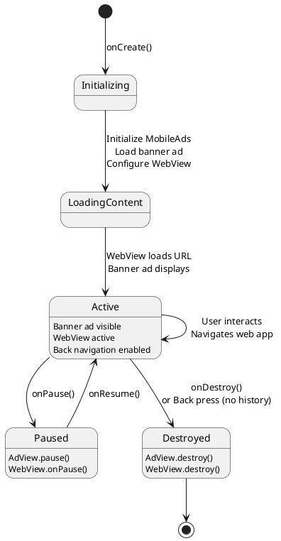

# WhatsOrder TWA - UML Documentation

## Project Overview

**WhatsOrder** is an Android Trusted Web Activity (TWA) application that wraps a web application (`https://whats-order-osr3.vercel.app/dashboard/`) with AdMob monetization integration.

---

## 1. Class Diagram



---

## 2. Activity Flow Sequence Diagram



---

## 3. Component Architecture Diagram



---

## 4. State Diagram - Launcher Activity



---

## 5. State Diagram - MainActivity



---

## 6. Build System Architecture

```
┌─────────────────────────────────────────┐
│         Project Root                     │
│  VercelAdTWA/VercelAdTWA/               │
│                                          │
│  ├── build.gradle (Project)             │
│  │   └── Android Gradle Plugin 8.1.1    │
│  │   └── Kotlin Plugin 1.9.0            │
│  │                                       │
│  ├── settings.gradle                     │
│  │   └── Project: "WhatsOrder"          │
│  │                                       │
│  └── app/                                │
│      ├── build.gradle (Module)          │
│      │   └── compileSdk: 34             │
│      │   └── minSdk: 21                 │
│      │   └── targetSdk: 34              │
│      │   └── Dependencies:              │
│      │       ├── AndroidX Core KTX      │
│      │       ├── AndroidX AppCompat     │
│      │       ├── Google Ads 22.6.0      │
│      │       ├── WebKit 1.8.0           │
│      │       └── ConstraintLayout       │
│      │                                   │
│      ├── src/main/                      │
│      │   ├── AndroidManifest.xml        │
│      │   ├── java/com/whatsorder/twa/   │
│      │   │   ├── LauncherActivity.kt    │
│      │   │   └── MainActivity.kt        │
│      │   └── res/                       │
│      │       ├── layout/                │
│      │       ├── values/                │
│      │       └── drawable/              │
│      │                                   │
│      └── proguard-rules.pro             │
│                                          │
└──────────────────────────────────────────┘
```

---

## 7. Key Technical Specifications

### Application Configuration
- **Package Name**: `com.whatsorder.twa`
- **Min SDK**: 21 (Android 5.0 Lollipop)
- **Target SDK**: 34 (Android 14)
- **Compile SDK**: 34

### AdMob Integration
- **App ID**: `ca-app-pub-5538218540896625~1234567890`
- **Interstitial Ad Unit**: `ca-app-pub-5538218540896625/8673958054`
- **Banner Ad Unit**: `ca-app-pub-5538218540896625/8498698237`

### Web Application
- **URL**: `https://whats-order-osr3.vercel.app/dashboard/`
- **WebView Features**:
  - JavaScript enabled
  - DOM storage enabled
  - Database enabled
  - Zoom controls (built-in, display hidden)

### Build Variants
- **Debug**: Standard debug build with debug signing
- **Release**: Minified with ProGuard optimization

---

## 8. Ad Flow Logic

### Launcher Activity (Splash with Interstitial)
1. **Initialize** MobileAds SDK
2. **Start** 3-second timeout timer
3. **Load** interstitial ad asynchronously
4. **Wait** for one of three outcomes:
   - ✅ Ad loads successfully → Show ad → Navigate to MainActivity
   - ❌ Ad fails to load → Set flag → Wait for timeout
   - ⏱️ Timeout (3s) reached → Navigate to MainActivity
5. **Navigate** to MainActivity and finish LauncherActivity

### MainActivity (Banner + WebView)
1. **Initialize** MobileAds SDK
2. **Create** banner AdView programmatically
3. **Add** banner to ad_container LinearLayout
4. **Load** banner ad
5. **Configure** WebView settings
6. **Load** web application URL
7. **Manage** lifecycle: pause/resume/destroy ads and WebView

---

## 9. Security & Permissions

### Required Permissions
```xml
<uses-permission android:name="android.permission.INTERNET" />
<uses-permission android:name="android.permission.ACCESS_NETWORK_STATE" />
```

### ProGuard Rules
- Applied in release builds
- Uses default Android optimization rules
- Custom rules in `proguard-rules.pro`

---

## 10. Dependencies Summary

| Library | Version | Purpose |
|---------|---------|---------|
| AndroidX Core KTX | 1.12.0 | Kotlin extensions |
| AndroidX AppCompat | 1.6.1 | Backward compatibility |
| Google Play Services Ads | 22.6.0 | AdMob monetization |
| AndroidX WebKit | 1.8.0 | WebView functionality |
| AndroidX ConstraintLayout | 2.1.4 | Layout management |
| Kotlin Gradle Plugin | 1.9.0 | Kotlin compilation |
| Android Gradle Plugin | 8.1.1 | Build automation |

---

## Build Commands Reference

```bash
# Clean build artifacts
./gradlew clean

# Build debug APK
./gradlew assembleDebug

# Build release APK
./gradlew assembleRelease

# Install debug APK on connected device
./gradlew installDebug

# Run all checks and build
./gradlew build

# List all available tasks
./gradlew tasks
```

**Output Locations:**
- Debug APK: `app/build/outputs/apk/debug/app-debug.apk`
- Release APK: `app/build/outputs/apk/release/app-release-unsigned.apk`
